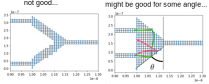
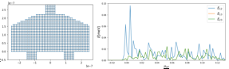

# Project Name
Trijunction design

## Research Goal
Manipulating Majoranas in a qubit requires coupling 3 or more Majoranas from different topological wires together (maybe not all at the same time).
Because Majorana wires require alignment with magnetic field, they have to also be parallel to each other.
Also because of the layout constraints, they have to be spatially separated.
The above factors combined, make the coupler design a nontrivial task.
That is exactly what we propose to do: investigate which geometries produce a good switch.
An extra advantage of this project is that it can be tested in the normal regime, bringing it within reach of ongoing experiments.

## Research Plan

We are interested in designig a ballistic cavity with three Majorana nanowires attached. The problem of a cavity with leads attached has been studied previously.
In these works, to measure the coupling between the leads, a conductance calculation has been performed and compared with classical conductance calculations.
A high agreement between the quantum and semi-classical pictures has been found in terms of trajectories, i.e. motion of a wavepacket inside a cavity.
It has been found that the shape of the cavity allows for the appearance of different kind of states that couple to the leads with a characteristic signature.
Also, it has been shown that the angle in which the leads are attached will enhance or decrease the coupling.

Given this background, we are interested in designing a cavity that will produce a high coupling between all pairs of Majorana states that belong to the topological
leads. For such purpose, we will explore different geometries for the cavity. It is important to mention that:

* So far we work in the strong coupling regime, i.e. no barriers between leads and cavity.
* We consider a global magnetic field parallel to the nanowires.
* The cavity has spin orbit interaction.

### Geometry dependence

We consider that the coupling between two leads will decrease the number of scattering processes connecting them increases. That is, if there's a lot of scattering
between two leads, the coupling between the states will be small. However, if there is the *right* amount of scattering, the coupling might be enhanced.

We are calculating the result for all $\theta$, but as an example consider $\theta=\pi/5$.

## What to do next:

* Finish calculation for all angles.
* Obtain coupling for all momentum channels inside the wires.
* Change the position of the leads.

## Working on this project
Configure the project by running

    ./setup
