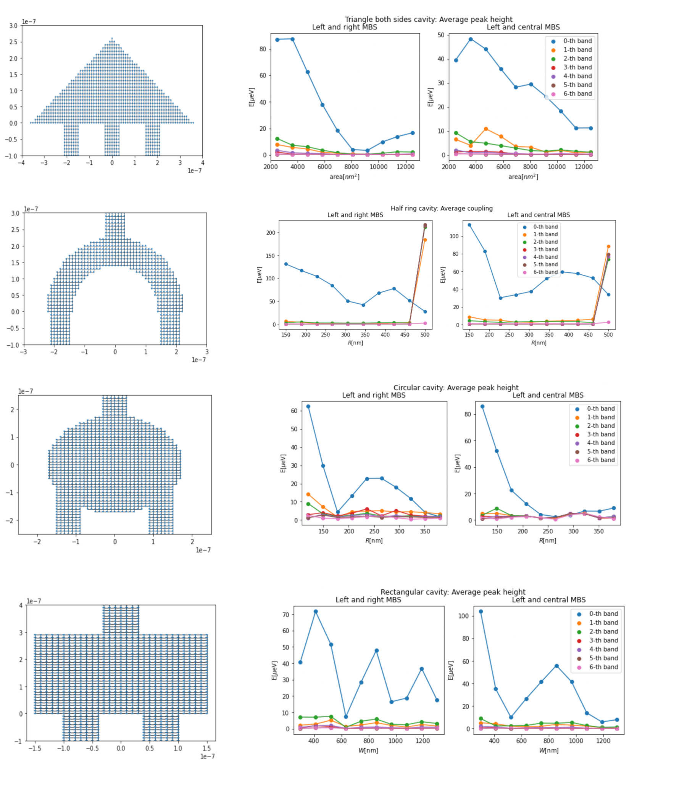
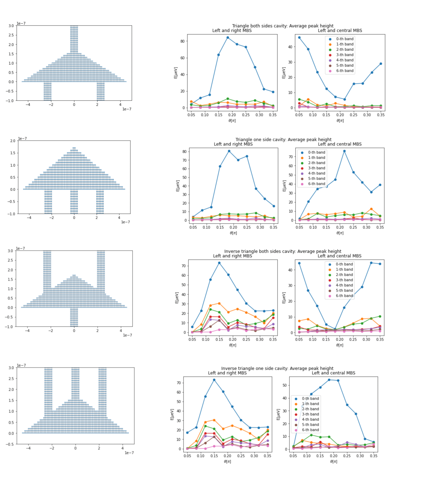
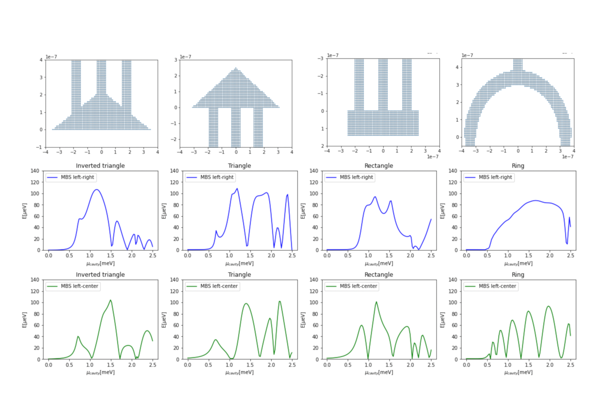
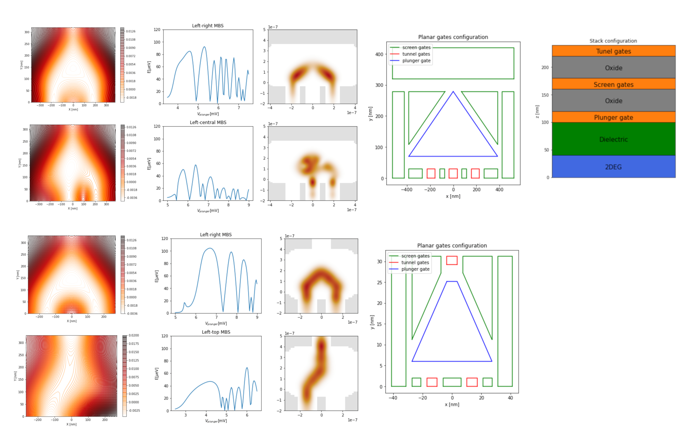

# Project Name
Trijunction design

## Research Goal
Manipulating Majoranas in a qubit requires coupling 3 or more Majoranas from different topological wires together. We propose to investigate which geometries produce a good switch.

## Research Plan

We are interested in modelling a ballistic cavity with three Majorana nanowires attached. 
The problem of a cavity with leads attached has been studied previously.
In these works, to measure the coupling between the leads, a conductance calculation has been performed and compared with classical conductance calculations.
Also, it has been shown that the angle in which the leads are attached will enhance or decrease the coupling.

Given this background, we are interested in designing a cavity that will produce a high coupling between all pairs of Majorana states that belong to the topological leads. For such purpose, we will explore different geometries for the cavity. After determining the pure geometrical dependence, we design a gate configuration where the system can be realized in a 2DEG. We study the electrostatics effects of the system.

It is important to mention that:

* So far we work in the strong coupling regime, i.e. no barriers between leads and cavity.
* We consider a global magnetic field parallel to the nanowires.
* The cavity has spin orbit interaction.

The parameters of the system are:

$
B_x = 0.8 [meV], \quad \Delta=0.5[meV], \quad \alpha = 0.4[eV A].
$

The chemical potential of the nanowires and the cavity and the phase differences between the wires are varied over the simulations.

## Geometrical dependence

We have studied the following shapes:
* Rectangular
* Circular
* Half ring
* Triangular

We want to address the following questions:

* How does the system size affect the coupling?
* What geometrical parameters can be used to control the MBS coupling?
* How do different Majorana bands couple via the cavity?
* Are there geometries such that all pairs of MBS have a *good* coupling?

### Size dependence
If system is small enough, it acts as a quantum dot. If it is too big, electrons get lost in a mesoscopic regime. So, what's in the middle?

### Angle dependence
* Maximum coupling as a function of angle for left and right MBS.
* If central MBS is at the other side of the caivty, minimum coupling as a function of angle for left and central MBS.
* If central MBS is at the same side of the cavity, another maximum as a function of angle.

### Candidates for a trijunction

If small enough, everything is good because we recover the quantum dot case where there's no geometry dependence, just a point.

Therefore, we are interested in big geometries with significant couplings. Here big means $\sim 0.5 \mu m$, and significant means about the same order of magnitude as $\Delta$, i.e. $\sim 100 \mu eV$.

Furthermore, we do not want a geometry that couples nicely only a single MBS pair, but all three of them.

Under such considerations, we've four geometries that can be considered *good*:

## Electrostatic configuration

We have considered the triangular geometries to be good candidates for a trijunction. Once we include a gate configuration, the geometry is influenced by all the gates in the system.

## What to do next:

* Find a way to automatically tune the gates to the optimal point.
* Write the thesis manuscript.

## Working on this project
Configure the project by running

    ./setup
