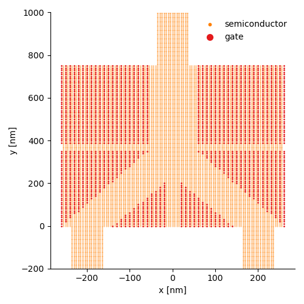
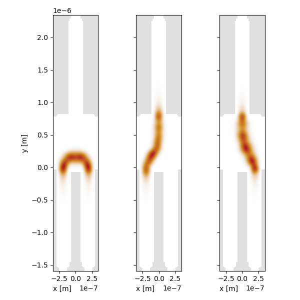

# Trijunction
It is used to find a global optima of the design of a trijunction geometry to couple (in scientific terms [braiding](https://medium.com/swlh/topological-quantum-computing-5b7bdc93d93f#0fa4)) more than one [Majorana fermion](https://medium.com/swlh/topological-quantum-computing-5b7bdc93d93f#58c0) pair  for [topological quantum computation](https://medium.com/swlh/topological-quantum-computing-5b7bdc93d93f#60da).

### Usage
Please clone the project github repository including it's submodules:
```
git clone --recurse-submodules https://github.com/Satin21/Trijunction.git
```

### Example
Using a rectangular semicondcutor cavity, we want to couple Majorana fermions which are localized at the ends of a semiconductor nanowire promitized by a superconductor. We discretize the semiconductor device with size of several hundreds of 100nm in three dimensions using finite volume method. We convert any gate geometry to a simulation model, although we currently handle a specific trijunction design as below.


<!--  -->

To start your own simulations, you first need to define a dictionary of device and gate configuration and save it in the `json` format. Please refer to `config.json` file for example. Then you need to create an instance of the Trijunction class with the configuration dictionary as follows:
```
system = trijunction.Trijunction(config)
```

Trijunction class runs several sanity checks to assure that your simulation is reliable. For instance, it checks whether the defined gate geometry is left-right symmetric upto an expected numerical precision around x=0 when the gate voltages are symmetric `Trijunction.check_symmetry([-1, -1, -1, 1])`.

With untuned gate voltages, Majoranas are decoupled.


<!--  -->

We can then tune the gate voltages to optimize the coupling between any two pair of Majoranas. We used scipy's optimize module to optimize the gates with our own loss function defined in the optimization module.

```
scipy.optimize.minimize(trijunction.optimization.loss, args, method='trust-constr', options={'initial_tr_radius':1e-3})
```

This system does not have a unique solution and have many local minimas, hence finding the global optimum is difficult. Thus we optimize gate voltages carefully at multiple stages with an efficient loss function and the outcome is

<!--  -->


Note: Please take a look at the example notebook in the home folder for further reference.

### Contributors
- [Juan Daniel Torres](https://quantumtinkerer.tudelft.nl/members/juan-daniel/) 
- [Anton Akhmerov](https://antonakhmerov.org/)

### Contribute
This project is still actively under development. We are exploring different configurations of trijunction geometry and benchmarking our optimization approach. If you find some issues in the code, please raise an issue or if you would like to contribute, please feel free to contact me at rksathish09@gmail.com.

### License
This project is licensed under BSD 2-Clause "Simplified" License.


